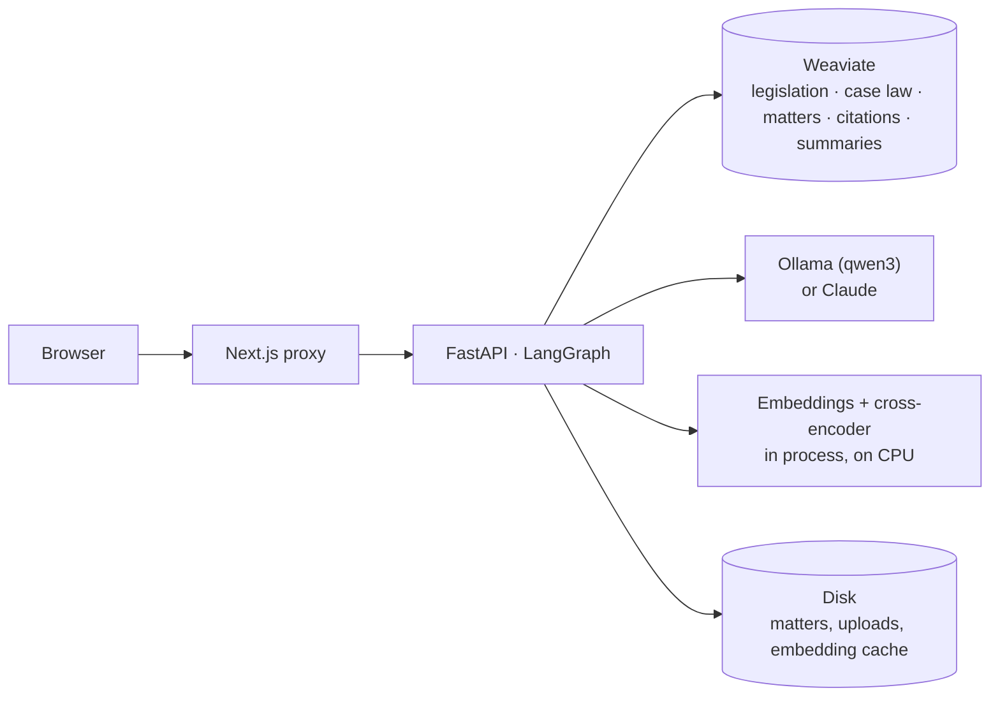
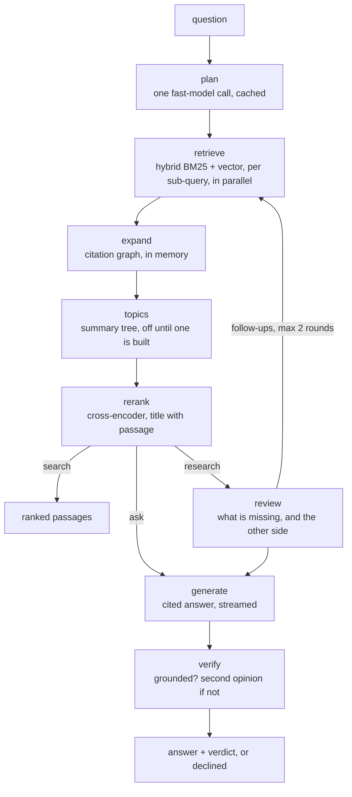
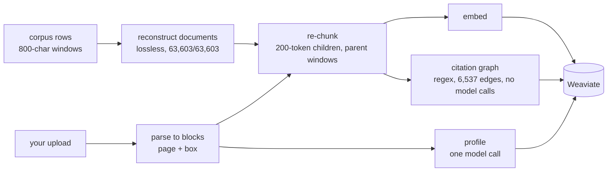

# Wakili

Legal research over Kenyan legislation and case law. Every claim in an answer is cited to a
passage you can open, the system checks its own answer against those passages, and it
declines rather than guesses.

- **Search** returns the ranked passages.
- **Ask** answers over them, cites each claim, then verifies and reports a verdict.
- **Research** reads what the first pass missed, searches again for the other side, and
  writes a memo.

Upload your own lease, demand letter or witness statement as a **matter** and it is indexed
beside the corpus, so "what does the law say" and "what does my contract say" are one
question. A citation to your own document opens the page with the passage highlighted.

| | |
|---|---|
| `backend/` | FastAPI · LangGraph · Weaviate · local embeddings and cross-encoder · PyMuPDF · Ollama or Claude |
| `frontend/` | Next.js 16 · TypeScript · Tailwind v4 |
| `corpus/` | 1,533 documents from new.kenyalaw.org — 543 Acts, 990 judgments, 7 courts (not committed; see [corpus/README.md](corpus/README.md)) |

## Run

```bash
cp backend/.env.example backend/.env            # optional Langfuse keys
docker compose up -d --build                    # Weaviate + Ollama + API on :8010
docker compose exec ollama ollama pull qwen3:8b # ~5 GB, once
docker compose exec app python -m app.corpus.ingest /corpus/all_chunks.json
docker compose exec app python -m app.graph.build    # citation graph, ~1 min, no model calls
docker compose restart app                      # catalog and graph load at startup

cd frontend && cp .env.example .env.local && npm install && npm run dev   # :3000
```

The first ingest takes a couple of hours — embedding is CPU-bound at ~8 chunks/s over ~85k
chunks — and is idempotent, resumable and cached, so re-runs are minutes.

## How it works

The browser only ever talks to the Next.js app, which proxies to the API and attaches the
shared secret server-side. Everything the API needs runs beside it.



A question takes one path through the graph, and the mode decides where it stops.



Indexing happens before any of that, and costs no model calls except a matter's profile.



## Models

Every model call goes to Ollama by default, so nothing costs anything per call.
`OLLAMA_MODEL` answers, writes memos and verifies; `OLLAMA_FAST_MODEL` plans, reviews and
extracts. Both default to `qwen3:8b`; a machine with the memory can run `qwen3:14b` or
`qwen3:30b` for the first.

```bash
LLM_PROVIDER=anthropic ANTHROPIC_API_KEY=…   # Claude instead: Sonnet answers, Haiku plans
OLLAMA_BASE_URL=http://host.docker.internal:11434   # a host install, not the service
```

One factory, `app/llm.py`, builds both roles for either provider; nothing downstream knows
which it has. An NVIDIA GPU needs the device reservation commented in `docker-compose.yml`.

## Numbers

[MEASUREMENTS.md](MEASUREMENTS.md) records every number this project has produced and what
changed between one and the next. The current ones, on the full corpus:

| | recall@5 | MRR | note |
|---|---|---|---|
| 36 golden questions | 100.0% | 0.981 | the planner's rewrites alone scored 97.2% — see below |
| 10 relationship questions | 100.0% | 0.950 | 80.0% / 0.750 without the citation graph |
| 20 matter questions | 100.0% | 0.871 | page@5 95%; 100% with only the matter in scope |

| answering, `qwen3:8b` | |
|---|---|
| faithfulness (ragas) | 0.960 |
| invalid citations | 0 of 34 answers |
| citation coverage | 0.607 — the model cites `[Act No. 16 of 1990, s. 8(a)]` where the contract wants `[n]` |
| one ask, end to end | 855 s p50 on a 16 GB CPU box (23.4 s on Claude) |

The planner's rewrites *lost* recall on their own: a paraphrase drops the exact wording
keyword search matches on. Kept as pure expansion — the original question always searched,
the plan adding to it — the layer improves ranking instead of costing recall.

## API

| | |
|---|---|
| `POST /query` | `{question, mode, filters?, matter_id?}` → plan, citations, answer, verdict |
| `POST /query/stream` | the same as SSE: `plan` → `sources` → `token`… → `done` → `verdict` |
| `GET /catalog` | what the corpus holds, for the filters |
| `GET /graph/{doc_id}` | what a document cites, and what cites it |
| `POST /matters`, `POST /matters/{id}/documents` | a matter and its files; indexed in the background |
| `GET /matters/{id}/events` | the matter as it is, then on every change, until nothing is indexing |
| `POST /workflows/research`, `POST /workflows/case-analysis` | jobs; `GET /workflows/{id}/events` follows either |

Rate-limited per client. `PROXY_SECRET` gates everything but `/health` when set, and the
frontend attaches it server-side so the browser stays same-origin.

## Evaluation

`backend/eval/` is its own uv project (ragas pins conflict with LangChain 1.x).

```bash
cd backend/eval
uv run python retrieval_benchmark.py --set golden|relationships|topics|matter
uv run python authorities_benchmark.py
bash gate.sh        # the faithfulness gate against the local stack; hours, resumable
```

CI runs the model-free benchmarks against their floors on every PR, and the faithfulness
gate beside them on a small local model — enough to hold the citation contract, not enough
to stand for the shipping model's quality. Those numbers come from `gate.sh`.

## Tests

```bash
cd backend && uv run ruff check app tests eval && uv run pytest
cd frontend && npx tsc --noEmit && npm run lint && npm run build
```

## More

- [docs/architecture.md](docs/architecture.md) — how the corpus is rebuilt, what each
  retrieval node does, the citation graph, the topic tree, case analysis, tracing.
- [DESIGN.md](DESIGN.md) and [PRODUCT.md](PRODUCT.md) — the design world and product truth.
